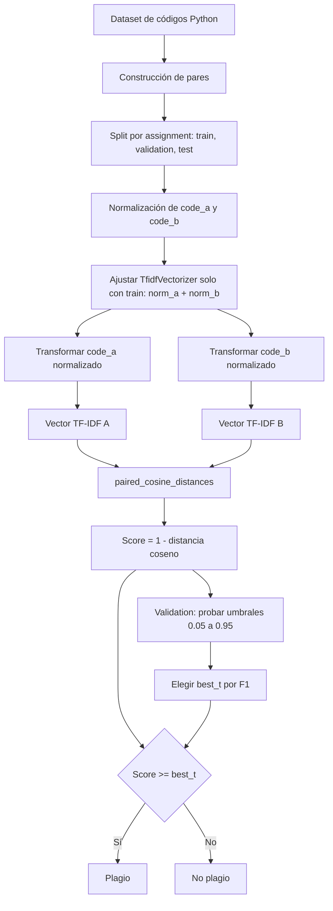
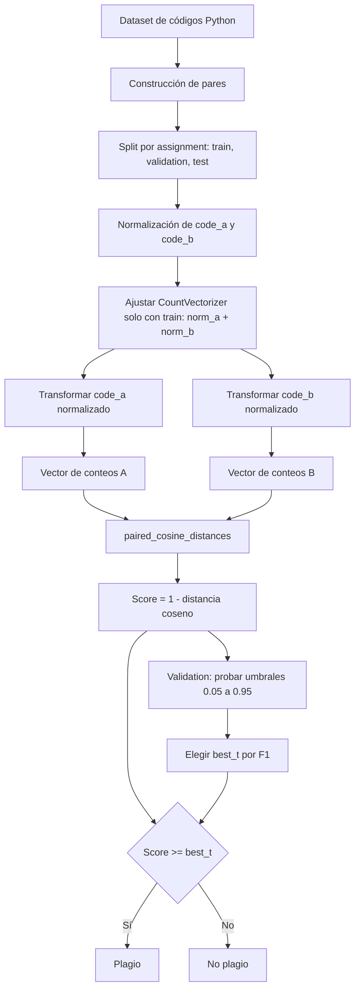
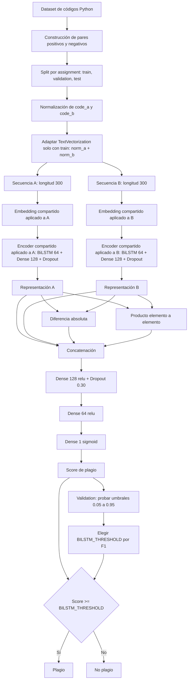
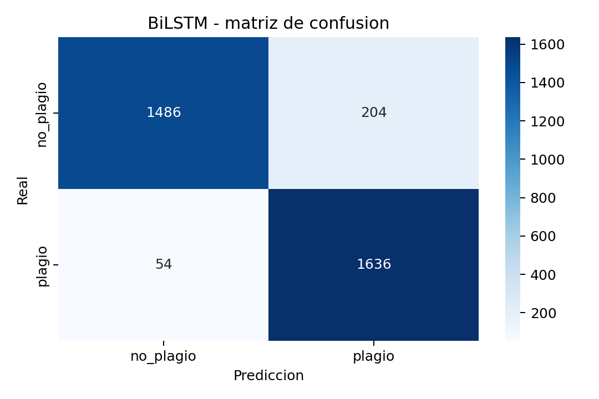

# Detección de plagio en código fuente

## Introducción
Este proyecto desarrolla un detector de plagio para código Python basado en técnicas de recuperación de información. La idea central es comparar dos fragmentos de código y determinar si su similitud sugiere que uno es una copia no autorizada del otro.

## Objetivo
El objetivo es construir un prototipo que reciba dos códigos Python y devuelva una predicción binaria: plagio o no plagio. Para lograrlo, se comparan tres enfoques: TF-IDF con similitud de coseno, Bag of Words con similitud de coseno y un modelo BiLSTM.

## Definición del proyecto
Es un proyecto para detección de plagio en código fuente. Básicamente, el sistema recibe dos fragmentos de código, los procesa y predice si existe plagio entre ellos.

## Descripción del dataset

El proyecto utiliza el **Python Plagiarism Code Dataset**, un conjunto de datos diseñado para entrenar y evaluar sistemas de detección de plagio de código escrito en Python. El dataset contiene implementaciones originales de problemas de programación y versiones sintéticas con distintos niveles de transformación.

El propósito del dataset es superar las limitaciones de herramientas tradicionales que dependen demasiado de similitud sintáctica. En casos de plagio más sofisticado, el código puede cambiar nombres, comentarios, orden de instrucciones o estructuras de control, pero conservar la misma funcionalidad. Por eso, este dataset permite evaluar si un modelo puede detectar similitud más allá de coincidencias superficiales.

### Estructura del dataset

El dataset contiene:
- **Código original**: soluciones fuente de problemas de programación en Python.
- **Versiones plagiadas**: variaciones sintéticas del código original con 6 niveles de transformación.
- **Modelos generadores**: las variantes fueron generadas usando DeepSeek Coder y GPT-4o-mini.
- **Problemas base**: los códigos originales fueron seleccionados a partir de MBPP (*Mostly Basic Python Problems*) de Google.

### Niveles de transformación

| Nivel | Tipo de transformación | Descripción |
|-------|------------------------|-------------|
| 1 | Copia casi literal | Conserva lógica, estructura y sintaxis; puede cambiar comentarios o indentación. |
| 2 | Renombrado de identificadores | Cambia nombres de variables, funciones u otros identificadores. |
| 3 | Cambio de comentarios | Modifica o reescribe comentarios sin alterar la lógica. |
| 4 | Reordenamiento de instrucciones | Cambia el orden de sentencias o bloques conservando la funcionalidad. |
| 5 | Cambio de estructuras de control | Modifica ciclos, condicionales o llamadas manteniendo el algoritmo principal. |
| 6 | Cambio de lógica | Altera de forma importante el algoritmo, pero busca producir el mismo resultado. |

El dataset incluye métricas de similitud como BERTScore, ROUGE y similitud de coseno basada en embeddings de código. En este proyecto, el dataset se usa como base para construir pares positivos y negativos, normalizar código y comparar el rendimiento de modelos estadísticos contra un modelo secuencial profundo.

# Algoritmos estadísticos

## TF-IDF
TF-IDF es una técnica de ponderación de términos que combina la frecuencia de un token en un documento con la rareza de ese token en todo el conjunto de documentos. En este caso se aplica sobre tokens de código normalizado para capturar diferencias de estilo y estructura.

### Funcionamiento
- Normaliza código Python para reducir ruido y enfocar la comparación en estructura y tokens relevantes.
- Convierte los fragmentos normalizados en vectores TF-IDF usando análisis de n-gramas de caracteres (`char_wb`).
- Calcula la similitud de coseno entre pares de códigos para estimar la probabilidad de plagio.
- Ajusta un umbral de decisión en un conjunto de validación para clasificar pares como plagio o no plagio.
- Evalúa el modelo en un conjunto de prueba con métricas como precisión, recall y F1.

### Diagrama de funcionamiento

### Procedimiento
1. Carga y preprocesamiento del dataset.
2. Construcción de pares de código:
   - pares positivos: código original contra sus variantes plagio.
   - pares negativos: código original contra código de asignaciones distintas.
3. Normalización de código:
   - eliminación de comentarios, saltos de línea y sangrías.
   - reemplazo de identificadores no reservados por `ID`.
   - reemplazo de literales de cadena por `STR` y números por `NUM`.
4. Vectorización TF-IDF:
   - `analyzer='char_wb'`
   - `ngram_range=(3, 8)`
   - `sublinear_tf=True`
   - `max_features=50000`
5. Cálculo de similitud y selección de umbral.

## Resultados obtenidos

### Matriz de confusión

Donde:
- Verdaderos Positivos (TP) = 1477
- Falsos Negativos (FN) = 213
- Falsos Positivos (FP) = 218
- Verdaderos Negativos (TN) = 1472

El conjunto de prueba arrojó las siguientes métricas:

| Métrica     | Valor                         |
|------------|-------------------------------|
| accuracy   | 0.8724852071005917            |
| recall     | 0.8710059171597633            |
| f1         | 0.8722962962962963            |

**Análisis de resultados**: La matriz muestra **1477** Verdaderos Positivos y **1472** Verdaderos Negativos, lo que confirma que el modelo acierta con una alta proporción de ejemplos tanto positivos como negativos.

- `accuracy` de **0.8725** indica que el modelo clasifica correctamente aproximadamente el 87.25% de todos los pares de código (tanto positivos como negativos).
- `recall` de **0.8710** muestra que el modelo detecta cerca del 87.10% de los plagios reales; los **213** falsos negativos representan los plagios que no fueron identificados.
- `f1` de **0.8723** resume el equilibrio entre precisión y recall en un único valor, indicando un rendimiento consistente.

El umbral de decisión elegido `0.705` representa el punto de corte sobre la similitud de coseno que ofrece un balance entre falsos positivos y falsos negativos en el conjunto de validación. 

Aumentar el umbral hace el detector más conservador: reduce las falsas alarmas (falsos positivos), pero aumenta los plagios omitidos (falsos negativos), lo que disminuye el `recall`. Por otro lado, disminuir el umbral hace el detector más permisivo: reduce los falsos negativos y mejora el `recall`, pero incrementa de gran manera los falsos positivos. El punto de corte elegido busca el equilibrio óptimo para maximizar el indicador global `f1` sin desplomar la `accuracy` general del sistema.

## Bag of Words (BoW)
Bag of Words es una técnica de representación de texto que extrae los tokens de un documento y cuenta su frecuencia de aparición absoluta, agrupándolos en una "bolsa" sin considerar su orden. A diferencia de TF-IDF, no aplica penalizaciones logarítmicas por la rareza del término en el corpus. En este caso se aplica sobre tokens de código normalizado para capturar diferencias de estilo y estructura.

### Funcionamiento
- Normaliza código Python para reducir ruido y enfocar la comparación en estructura y tokens relevantes.
- Convierte los fragmentos normalizados en vectores de conteo de frecuencias (BoW) usando análisis de n-gramas de caracteres (`char_wb`).
- Calcula la similitud de coseno entre pares de códigos para estimar la probabilidad de plagio.
- Ajusta un umbral de decisión en un conjunto de validación para clasificar pares como plagio o no plagio.
- Evalúa el modelo en un conjunto de prueba con métricas como precisión, recall y F1.

### Diagrama de funcionamiento

### Procedimiento
1. Carga y preprocesamiento del dataset.
2. Construcción de pares de código:
   - pares positivos: código original contra sus variantes plagio.
   - pares negativos: código original contra código de asignaciones distintas.
3. Normalización de código:
   - eliminación de comentarios, saltos de línea y sangrías.
   - reemplazo de identificadores no reservados por `ID`.
   - reemplazo de literales de cadena por `STR` y números por `NUM`.
4. Vectorización Bag of Words:
   - `analyzer='char_wb'`
   - `ngram_range=(3, 8)`
   - `max_features=50000`
5. Cálculo de similitud y selección de umbral.

## Resultados obtenidos

### Matriz de confusión

Donde:
- Verdaderos Positivos (TP) = 1442
- Falsos Negativos (FN) = 248
- Falsos Positivos (FP) = 158
- Verdaderos Negativos (TN) = 1532

El conjunto de prueba arrojó las siguientes métricas:

| Métrica     | Valor                         |
|------------|-------------------------------|
| accuracy   | 0.8798816568047337            |
| recall     | 0.906508875739645             |
| f1         | 0.8829971181556195            |

**Análisis de resultados**: La matriz muestra **1532** Verdaderos Positivos y **1442** Verdaderos Negativos, lo que confirma que el modelo acierte con una alta proporción de ejemplos tanto positivos como negativos.

- `accuracy` de **0.8799** indica que el modelo clasifica correctamente aproximadamente el 87.99% de todos los pares de código (tanto positivos como negativos).
- `recall` de **0.9065** muestra que el modelo detecta cerca del 90.65% de los plagios reales; los **158** falsos negativos representan los plagios que no fueron identificados.
- `f1` de **0.8830** resume el equilibrio entre precisión y recall en un único valor, indicando un rendimiento consistente.

El umbral de decisión elegido `0.95` representa el punto de corte sobre la similitud de coseno que ofrece un balance entre falsos positivos y falsos negativos en el conjunto de validación. Debido a que BoW mide frecuencias absolutas sin atenuar las palabras comunes (como estructuras nativas de Python que se repiten en casi cualquier código), las puntuaciones vectoriales de similitud son inherentemente más altas que en TF-IDF. Por ello, el algoritmo requiere un umbral drásticamente más estricto (`0.95` frente al `0.705` de TF-IDF) para discernir correctamente el plagio.

Aumentar el umbral hace el detector más conservador: reduce las falsas alarmas (falsos positivos), pero aumenta los plagios omitidos (falsos negativos), lo que disminuye el `recall`. Por otro lado, disminuir el umbral hace el detector más permisivo: reduce los falsos negativos y mejora el `recall`, pero incrementa de gran manera los falsos positivos. El punto de corte elegido busca el equilibrio óptimo para maximizar el indicador global `f1` sin desplomar la `accuracy` general del sistema.

# Modelo BiLSTM

BiLSTM es un modelo de aprendizaje profundo que procesa secuencias de tokens en dos direcciones: de izquierda a derecha y de derecha a izquierda. En este proyecto se usa para aprender una representación vectorial de cada fragmento de código y comparar ambos vectores para predecir si existe plagio.

## Funcionamiento
- Normaliza los dos fragmentos de código igual que los modelos estadísticos.
- Convierte los tokens normalizados en secuencias numéricas con `TextVectorization`.
- Usa una capa `Embedding` para representar cada token como vector denso.
- Procesa cada secuencia con un encoder BiLSTM compartido.
- Compara las dos representaciones con diferencia absoluta y producto elemento a elemento.
- Clasifica el par con capas densas y una salida `sigmoid`.

## Diagrama de funcionamiento

## Resultados obtenidos

El modelo BiLSTM fue entrenado con pares balanceados de código: 16,094 pares para entrenamiento, 3,442 para validación y 3,380 para prueba. La división se hizo por `assignment`, evitando que una misma asignación apareciera al mismo tiempo en entrenamiento, validación y prueba.

Durante el entrenamiento se usó `EarlyStopping`, por lo que el proceso se detuvo después de 3 épocas. El mejor umbral de decisión se seleccionó sobre el conjunto de validación maximizando F1, igual que en los modelos estadísticos. El umbral elegido fue `0.875`.

### Matriz de confusión

La matriz de confusión del conjunto de prueba se resume así:

|                      | Predicción: plagio | Predicción: no plagio |
|----------------------|--------------------|------------------------|
| Real: plagio         | 1636               | 54                     |
| Real: no plagio      | 204                | 1486                   |

Donde:
- Verdaderos Positivos (TP) = 1636
- Falsos Negativos (FN) = 54
- Falsos Positivos (FP) = 204
- Verdaderos Negativos (TN) = 1486

El conjunto de prueba arrojó las siguientes métricas:

| Métrica     | Valor              |
|------------|--------------------|
| accuracy   | 0.923669           |
| precision  | 0.889130           |
| recall     | 0.968047           |
| f1         | 0.926912           |
| threshold  | 0.875              |

**Análisis de resultados**: El modelo BiLSTM obtiene el mejor rendimiento global de los tres enfoques reportados, con un `f1` de **0.9269** y una `accuracy` de **0.9237** en prueba. Su principal fortaleza es el `recall` de **0.9680**, lo que significa que detecta la gran mayoría de los casos reales de plagio y deja pocos falsos negativos.

El costo de este comportamiento es que genera más falsos positivos que falsos negativos: clasificó como plagio **204** pares que realmente eran negativos. Esto indica que el modelo es más sensible a patrones estructurales parecidos entre códigos de asignaciones distintas. Aun así, el balance general es favorable porque reduce mucho los plagios omitidos, que suelen ser el error más delicado en un detector de plagio.

El umbral `0.875` hace que el modelo sea más estricto que una clasificación directa con `0.50`, pero aun así mantiene una tendencia a favorecer la detección de plagio. Por eso, cuando aparecen ejemplos con `label = 0` y `prediction = 1`, no significa que las etiquetas estén mal: son falsos positivos donde el modelo encontró alta similitud entre códigos que pertenecen a asignaciones diferentes.

## Comparación general

| Modelo        | Accuracy | Recall | F1     | Umbral |
|---------------|----------|--------|--------|--------|
| TF-IDF        | 0.8725   | 0.8710 | 0.8723 | 0.705  |
| Bag of Words  | 0.8799   | 0.9065 | 0.8830 | 0.950  |
| BiLSTM        | 0.9237   | 0.9680 | 0.9269 | 0.875  |

En esta comparación, BiLSTM supera a TF-IDF y BoW en `accuracy`, `recall` y `f1`. Esto sugiere que aprender representaciones secuenciales del código permite capturar relaciones más ricas que las representaciones basadas únicamente en frecuencia o ponderación de n-gramas. Sin embargo, TF-IDF y BoW siguen siendo modelos más simples, rápidos e interpretables, por lo que funcionan como líneas base útiles para medir la mejora real del modelo profundo.

## Diagnóstico de ajuste

El comportamiento del modelo BiLSTM indica un **buen ajuste general**. No se observa underfitting, porque el modelo alcanza métricas altas en entrenamiento, validación y prueba. Tampoco se observa un overfitting fuerte, porque la diferencia entre los resultados de entrenamiento y prueba es pequeña.

| Split        | Accuracy | Precision | Recall | F1     |
|--------------|----------|-----------|--------|--------|
| Train        | 0.9292   | 0.9026    | 0.9621 | 0.9314 |
| Validation   | 0.9277   | 0.9075    | 0.9524 | 0.9294 |
| Test         | 0.9237   | 0.8891    | 0.9680 | 0.9269 |

La diferencia entre `train_f1 = 0.9314` y `test_f1 = 0.9269` es de aproximadamente **0.0045**, lo cual es muy bajo. Esto sugiere que el modelo generaliza bien y que no está memorizando de forma importante el conjunto de entrenamiento.

Durante el entrenamiento, la pérdida de validación mejora en la primera época y luego empieza a empeorar ligeramente, mientras que las métricas se mantienen altas. Por eso se usa `EarlyStopping`, que detiene el entrenamiento después de 3 épocas y restaura los mejores pesos. Este comportamiento puede interpretarse como un **inicio de sobreajuste leve**, pero controlado por la detención temprana.

## Limitaciones

- El dataset contiene plagio sintético generado por LLMs. Aunque simula escenarios académicos, puede no capturar toda la diversidad de plagio humano real.
- Los pares negativos se construyen comparando código de asignaciones distintas. Algunos falsos positivos pueden aparecer cuando dos problemas diferentes tienen soluciones estructuralmente parecidas.
- La normalización reemplaza identificadores, cadenas y números por tokens genéricos (`ID`, `STR`, `NUM`). Esto reduce ruido, pero también elimina información que podría ser útil en algunos casos.
- TF-IDF y BoW dependen de n-gramas de caracteres, por lo que capturan similitud superficial y estructural, pero no entienden completamente la semántica del programa.
- BiLSTM mejora el rendimiento, pero sigue trabajando sobre tokens normalizados y secuencias truncadas a una longitud máxima de 300 tokens.

## Mejoras futuras

- Evaluar modelos basados en Transformers especializados en código, como CodeBERT, GraphCodeBERT o embeddings modernos de código.
- Incorporar representaciones estructurales como AST, grafos de flujo de control o grafos de dependencias para capturar similitud semántica más profunda.
- Agregar validación cruzada por `assignment` para estimar mejor la estabilidad de los resultados.
- Evaluar métricas adicionales como ROC-AUC.

# Autores
- Axel Camacho
- Cristián Chávez
- Benjamín Arauz

# Referencia

[1] Halim, Jimmy & Lasut, Desiyanna. (2024). Document Plagiarism Detection Application Using Web-Based TF-IDF and Cosine Similarity Methods: English. bit-Tech. 7. 202-213. 10.32877/bt.v7i2.1697.

[2] Ali, Ayoob & Taqa, Alaa Yassen, "Analytical Study of Traditional and Intelligent Textual Plagiarism Detection Approaches," Journal of Education and Science, vol. 31, no. 1, pp. 8-25, 2022.
