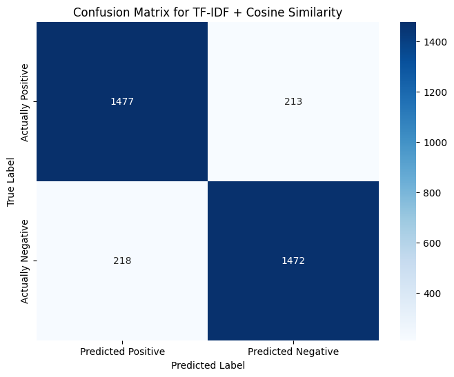
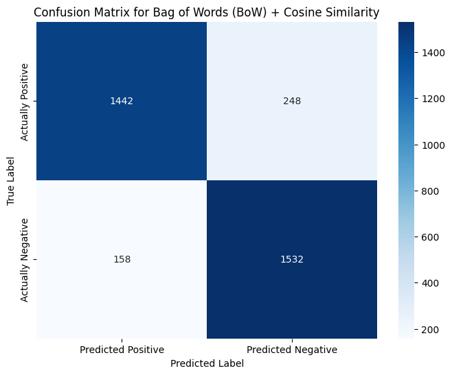

# Detección de plagio en código fuente

## Introducción
Este proyecto desarrolla un detector de plagio para código Python basado en técnicas de recuperación de información. La idea central es comparar dos fragmentos de código y determinar si su similitud sugiere que uno es una copia no autorizada del otro.

## Objetivo
El objetivo es construir un prototipo que reciba dos códigos Python y devuelva una predicción binaria: plagio o no plagio. Para lograrlo, se utiliza normalización de código, vectorización TF-IDF y similitud de coseno.

## Definición del proyecto
Es un proyecto para detección de plagio en código fuente. Básicamente, el sistema recibe dos fragmentos de código, los procesa y predice si existe plagio entre ellos.

# Algoritmos estadísticos

## TF-IDF
TF-IDF es una técnica de ponderación de términos que combina la frecuencia de un token en un documento con la rareza de ese token en todo el conjunto de documentos. En este caso se aplica sobre tokens de código normalizado para capturar diferencias de estilo y estructura.

### Funcionamiento
- Normaliza código Python para reducir ruido y enfocar la comparación en estructura y tokens relevantes.
- Convierte los fragmentos normalizados en vectores TF-IDF usando análisis de n-gramas de caracteres (`char_wb`).
- Calcula la similitud de coseno entre pares de códigos para estimar la probabilidad de plagio.
- Ajusta un umbral de decisión en un conjunto de validación para clasificar pares como plagio o no plagio.
- Evalúa el modelo en un conjunto de prueba con métricas como precisión, recall y F1.

### Procedimiento
1. Carga y preprocesamiento del dataset.
2. Construcción de pares de código:
   - pares positivos: código original contra sus variantes plagio.
   - pares negativos: código original contra código de asignaciones distintas.
3. Normalización de código:
   - eliminación de comentarios, saltos de línea y sangrías.
   - reemplazo de identificadores no reservados por `ID`.
   - reemplazo de literales de cadena por `STR` y números por `NUM`.
4. Vectorización TF-IDF:
   - `analyzer='char_wb'`
   - `ngram_range=(3, 8)`
   - `sublinear_tf=True`
   - `max_features=50000`
5. Cálculo de similitud y selección de umbral.

## Resultados obtenidos

### Matriz de confusión

Donde:
- Verdaderos Positivos (TP) = 1477
- Falsos Negativos (FN) = 213
- Falsos Positivos (FP) = 218
- Verdaderos Negativos (TN) = 1472

El conjunto de prueba arrojó las siguientes métricas:

| Métrica     | Valor                         |
|------------|-------------------------------|
| accuracy   | 0.8724852071005917            |
| recall     | 0.8710059171597633            |
| f1         | 0.8722962962962963            |

**Análisis de resultados**: La matriz muestra **1477** Verdaderos Positivos y **1472** Verdaderos Negativos, lo que confirma que el modelo acierta con una alta proporción de ejemplos tanto positivos como negativos.

- `accuracy` de **0.8725** indica que el modelo clasifica correctamente aproximadamente el 87.25% de todos los pares de código (tanto positivos como negativos).
- `recall` de **0.8710** muestra que el modelo detecta cerca del 87.10% de los plagios reales; los **213** falsos negativos representan los plagios que no fueron identificados.
- `f1` de **0.8723** resume el equilibrio entre precisión y recall en un único valor, indicando un rendimiento consistente.

El umbral de decisión elegido `0.705` representa el punto de corte sobre la similitud de coseno que ofrece un balance entre falsos positivos y falsos negativos en el conjunto de validación. 

Aumentar el umbral hace el detector más conservador: reduce las falsas alarmas (falsos positivos), pero aumenta los plagios omitidos (falsos negativos), lo que disminuye el `recall`. Por otro lado, disminuir el umbral hace el detector más permisivo: reduce los falsos negativos y mejora el `recall`, pero incrementa de gran manera los falsos positivos. El punto de corte elegido busca el equilibrio óptimo para maximizar el indicador global `f1` sin desplomar la `accuracy` general del sistema.

## Bag of Words (BoW)
Bag of Words es una técnica de representación de texto que extrae los tokens de un documento y cuenta su frecuencia de aparición absoluta, agrupándolos en una "bolsa" sin considerar su orden. A diferencia de TF-IDF, no aplica penalizaciones logarítmicas por la rareza del término en el corpus. En este caso se aplica sobre tokens de código normalizado para capturar diferencias de estilo y estructura.

### Funcionamiento
- Normaliza código Python para reducir ruido y enfocar la comparación en estructura y tokens relevantes.
- Convierte los fragmentos normalizados en vectores de conteo de frecuencias (BoW) usando análisis de n-gramas de caracteres (`char_wb`).
- Calcula la similitud de coseno entre pares de códigos para estimar la probabilidad de plagio.
- Ajusta un umbral de decisión en un conjunto de validación para clasificar pares como plagio o no plagio.
- Evalúa el modelo en un conjunto de prueba con métricas como precisión, recall y F1.

### Procedimiento
1. Carga y preprocesamiento del dataset.
2. Construcción de pares de código:
   - pares positivos: código original contra sus variantes plagio.
   - pares negativos: código original contra código de asignaciones distintas.
3. Normalización de código:
   - eliminación de comentarios, saltos de línea y sangrías.
   - reemplazo de identificadores no reservados por `ID`.
   - reemplazo de literales de cadena por `STR` y números por `NUM`.
4. Vectorización Bag of Words:
   - `analyzer='char_wb'`
   - `ngram_range=(3, 8)`
   - `max_features=50000`
5. Cálculo de similitud y selección de umbral.

## Resultados obtenidos

### Matriz de confusión

Donde:
- Verdaderos Positivos (TP) = 1442
- Falsos Negativos (FN) = 248
- Falsos Positivos (FP) = 158
- Verdaderos Negativos (TN) = 1532

El conjunto de prueba arrojó las siguientes métricas:

| Métrica     | Valor                         |
|------------|-------------------------------|
| accuracy   | 0.8798816568047337            |
| recall     | 0.906508875739645             |
| f1         | 0.8829971181556195            |

**Análisis de resultados**: La matriz muestra **1532** Verdaderos Positivos y **1442** Verdaderos Negativos, lo que confirma que el modelo acierte con una alta proporción de ejemplos tanto positivos como negativos.

- `accuracy` de **0.8799** indica que el modelo clasifica correctamente aproximadamente el 87.99% de todos los pares de código (tanto positivos como negativos).
- `recall` de **0.9065** muestra que el modelo detecta cerca del 90.65% de los plagios reales; los **158** falsos negativos representan los plagios que no fueron identificados.
- `f1` de **0.8830** resume el equilibrio entre precisión y recall en un único valor, indicando un rendimiento consistente.

El umbral de decisión elegido `0.95` representa el punto de corte sobre la similitud de coseno que ofrece un balance entre falsos positivos y falsos negativos en el conjunto de validación. Debido a que BoW mide frecuencias absolutas sin atenuar las palabras comunes (como estructuras nativas de Python que se repiten en casi cualquier código), las puntuaciones vectoriales de similitud son inherentemente más altas que en TF-IDF. Por ello, el algoritmo requiere un umbral drásticamente más estricto (`0.95` frente al `0.705` de TF-IDF) para discernir correctamente el plagio.

Aumentar el umbral hace el detector más conservador: reduce las falsas alarmas (falsos positivos), pero aumenta los plagios omitidos (falsos negativos), lo que disminuye el `recall`. Por otro lado, disminuir el umbral hace el detector más permisivo: reduce los falsos negativos y mejora el `recall`, pero incrementa de gran manera los falsos positivos. El punto de corte elegido busca el equilibrio óptimo para maximizar el indicador global `f1` sin desplomar la `accuracy` general del sistema.

# Autores
- Axel Camacho
- Cristián Chávez
- Benjamín Arauz

# Referencia

[1] Halim, Jimmy & Lasut, Desiyanna. (2024). Document Plagiarism Detection Application Using Web-Based TF-IDF and Cosine Similarity Methods: English. bit-Tech. 7. 202-213. 10.32877/bt.v7i2.1697.

[2] Ali, Ayoob & Taqa, Alaa Yassen, "Analytical Study of Traditional and Intelligent Textual Plagiarism Detection Approaches," Journal of Education and Science, vol. 31, no. 1, pp. 8-25, 2022.
